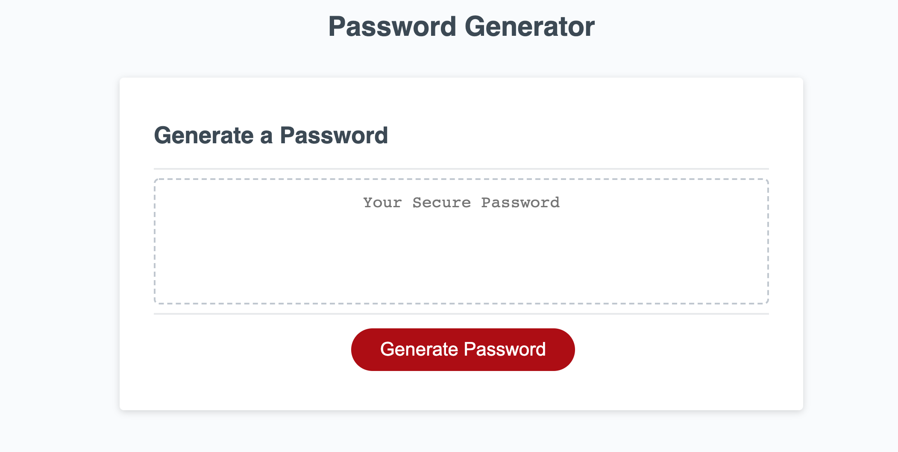

# passcode-generator
Description
This is a passcode generator that generates a number between 8 and 128, it will ask if you want uppercase, lowercase, numbers or symbols. This wil then print out the passcode for you to copy and paste.

##Usage
This can be used to create randomized custom passwords, this creats a more secure password. All you need to do is click generator and enter the responses to the prompts about what ou want to the password to contain. Once you have answered these questions it will automatically randomize a secure password for you to use. 

## Usage

    ```md
    
    ```

